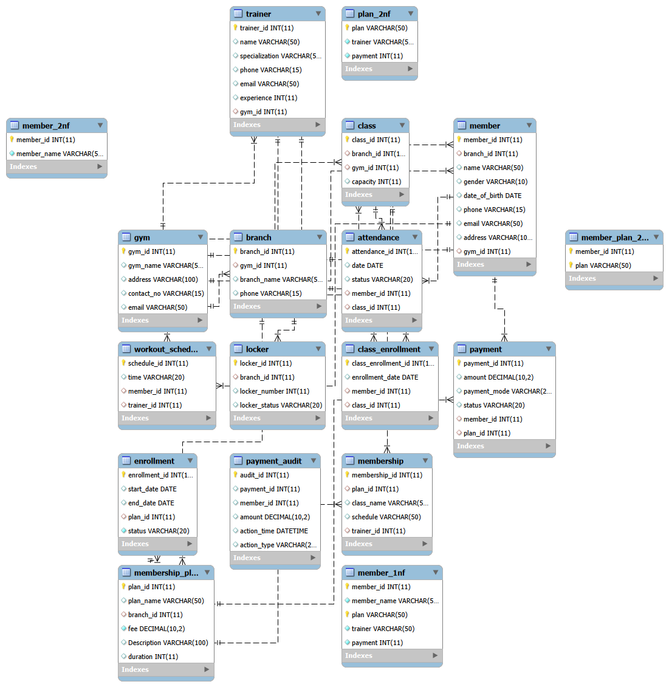

# 🏋️ Gym Management System

A full-stack **Gym Management System** designed to simplify the day-to-day operations of a fitness center. The application provides an intuitive interface for managing members, trainers, membership plans, enrollments, and payments while using a RESTful backend API and a MySQL database for reliable data management.

This project demonstrates full-stack web development concepts including CRUD operations, RESTful API development, relational database design, and responsive web interfaces.

---

## 📌 Features

* 📊 Dashboard with gym management overview
* 👥 Member Management (Create, Read, Update, Delete)
* 🏋️ Trainer Management
* 💳 Membership Plan Management
* 📝 Member Enrollment
* 💰 Payment Management
* 🗄️ MySQL Database Integration
* 🔄 RESTful API Architecture
* 📱 Responsive User Interface
* ⚡ Fast and lightweight application

---

## 🛠 Tech Stack

### Frontend

* HTML5
* CSS3
* JavaScript (ES6)

### Backend

* Node.js
* Express.js

### Database

* MySQL

### Development Tools

* Git
* GitHub
* Postman
* VS Code

---

## 📂 Project Structure

```text
Gym_Management_System/
│
├── backend/
│   ├── routes/
│   ├── config/
│   ├── node_modules/
│   ├── package.json
│   ├── server.js
│   └── .env
│
├── frontend/
│   ├── css/
│   ├── js/
│   ├── images/
│   ├── pages/
│   └── index.html
│
├── database/
│   └── gym_management.sql
│
├── README.md
├── .gitignore
└── LICENSE
```

---

## 🚀 Getting Started

### 1. Clone the Repository

```bash
git clone https://github.com/saktronX/Gym_Management_system.git
```

### 2. Navigate to the Project

```bash
cd Gym_Management_system
```

### 3. Install Backend Dependencies

```bash
cd backend
npm install
```

### 4. Configure Environment Variables

Create a `.env` file inside the `backend` folder.

```env
DB_HOST=localhost
DB_USER=your_username
DB_PASSWORD=your_password
DB_NAME=gym_management
PORT=5000
```

### 5. Import the Database

```sql
CREATE DATABASE Gym_Management_System;
USE Gym_Management_System;
```

Then import `gym_management.sql` using MySQL Workbench, phpMyAdmin, or the MySQL command line.

### 6. Start the Server

```bash
npm start
```

or

```bash
node server.js
```

The backend will start on:

```
http://localhost:5000
```

Open the frontend in your browser to begin using the application.

---

## 🗃 Database Modules

The project manages the following entities:

* Members
* Trainers
* Membership Plans
* Payments
* Enrollments
* Classes
* Gym Branches
* Maintenance Records
* Lockers

The Gym Management System uses **MySQL** as its relational database. Database design, schema creation, data management, and migrations were performed using **XAMPP** and **phpMyAdmin**.

### Database Files

- **gym_management.sql** – Complete MySQL database schema for setting up the project.
- **migrate_v2.sql** – Migration script containing schema updates and modifications.
- **MIGRATION_NOTES.md** – Documentation describing the migration changes.

### Entity Relationship Diagram

The following ER diagram illustrates the database structure and relationships between the project's tables.



---

## 🌐 REST API Overview

| Method | Endpoint       | Description        |
| ------ | -------------- | ------------------ |
| GET    | `/members`     | Get all members    |
| POST   | `/members`     | Add a new member   |
| PUT    | `/members/:id` | Update member      |
| DELETE | `/members/:id` | Delete member      |
| GET    | `/trainers`    | Get trainers       |
| POST   | `/trainers`    | Add trainer        |
| GET    | `/plans`       | Membership plans   |
| GET    | `/payments`    | Payment records    |
| POST   | `/payments`    | Add payment        |
| GET    | `/enrollments` | Member enrollments |

---

## 📸 Screenshots

> Add screenshots of your application inside an `assets/` folder and replace the placeholders below.

### Dashboard

```
assets/dashboard.png
```

### Members

```
assets/members.png
```

### Trainers

```
assets/trainers.png
```

### Membership Plans

```
assets/plans.png
```

### Payments

```
assets/payments.png
```

---

## 🔮 Future Enhancements

* User Authentication
* Role-Based Access Control
* Attendance Tracking
* Workout Schedule Management
* Diet Plan Management
* Email Notifications
* Report Generation
* Analytics Dashboard
* Docker Deployment
* Cloud Hosting

---

## 🧪 Testing

You can test the REST APIs using **Postman** or any API client.

Verify CRUD operations for:

* Members
* Trainers
* Membership Plans
* Payments
* Enrollments

---

## 🤝 Contributing

Contributions are welcome.

1. Fork the repository.
2. Create a new feature branch.
3. Commit your changes.
4. Push the branch.
5. Open a Pull Request.

---

## 📄 License

This project is licensed under the **MIT License**.

---

## 👥 Contributors

### Saksham Verma
- Full-stack application development
- Backend API development
- Frontend implementation
- Project architecture
* GitHub: https://github.com/saktronX
* LinkedIn: https://www.linkedin.com/in/saksham-verma22/

### Anant Singh Kushwaha
- Database schema design and improvements
- Relational database normalization
- Entity Relationship (ER) Diagram
- Foreign key relationships and schema updates
- Database documentation
* GitHub: https://github.com/Anant2k05
* LinkedIn: https://www.linkedin.com/in/anant-s-kushwaha-24310b1a1/

---

## ⭐ Support

If you found this project useful, consider giving it a **⭐ Star** on GitHub. It helps others discover the project and supports future development.
